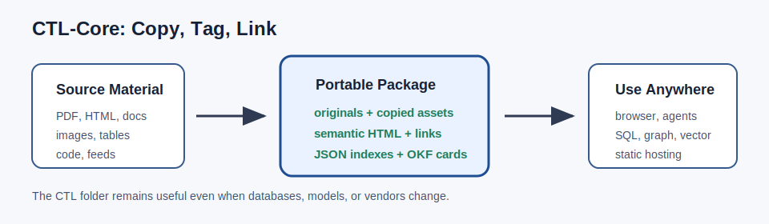

# CTL-Core

**Copy, Tag, Link source material into portable semantic HTML packages.**

**Semantic HTML is the source-of-truth view for CTL memory.**

CTL-Core does **not** convert rich sources into Markdown as the main memory
format. The durable package is semantic HTML plus preserved files, copied
assets, manifests, JSON records, and rebuildable indexes. Markdown appears only
as optional OKF-compatible catalogue cards that point back to the richer CTL
package.



CTL-Core is a **local-first durable memory layer**, not a database and not a
model wrapper. It turns source material into ordinary folders of preserved
originals, reusable copied assets, semantic HTML, provenance records, search
indexes, and OKF-compatible Markdown cards.

It is built for AI agents, RAG systems, wiki workflows, research archives,
classroom materials, and publishing pipelines that need memory to survive model
accounts, vendors, databases, clouds, and dashboards.

The package can be opened as a static website, read as a human archive, or
indexed by SQL, graph, vector, and agent workflows. The HTML remains useful
even when the database changes, disappears, or gets rebuilt.

CTL keeps the original files as preserved evidence. The semantic HTML is the
stable source-of-truth view that humans and agents read. JSON, OKF Markdown
cards, SQL tables, graph exports, vector embeddings, and RAG chunks are
derivative indexes that can be rebuilt from the package.

## What CTL-Core Is In One Sentence

CTL-Core is a vendor-neutral, database-optional, local-first evidence package
format for shared AI memory: preserve the source, copy useful parts, tag
provenance and structure, link everything, then index it with whatever tools you
trust.

## Why File-First?

CTL-Core is designed to avoid vendor lock-in. The durable memory layer is not a
model account, SaaS dashboard, vector database, or cloud bucket. It is an
ordinary folder of source files, assets, semantic HTML, JSON indexes, and
OKF-compatible cards.

That folder can be copied, zipped, backed up, hosted as static files, synced to
cloud storage, indexed by different databases, or handed to different AI agents.
If a vendor disappears, a database is wiped, or a server fails, the CTL package
still contains the human-readable source, provenance, and rebuildable indexes.

For multi-agent workflows, CTL-Core can act as shared memory that OpenAI,
Gemini, Claude, local models, human reviewers, and future tools can all read
without needing the same database or platform.

## What CTL-Core Produces

A CTL package is a folder you can open, zip, back up, publish as static files,
or index with whatever database you prefer.

```text
package/
  assets/
    original/       original source files
    images/         copied/extracted image assets
    tables/         canonical CTL records
  documents/        plain semantic HTML review pages
  manifests/        provenance and source metadata
  okf/              OKF-compatible Markdown cards
  intermediate/     adapter-specific raw outputs
  manifest.json
  search.json
```

Databases are optional acceleration layers. The semantic HTML package remains
the source-of-truth memory layer.

## Quick Start

This first public slice uses only the Python standard library and a generated
HTML sample.

```shell
python scripts/ctl_parser_lab.py samples/simple-source/market-snapshot.html -o output/demo-market-snapshot
```

Then open:

```text
output/demo-market-snapshot/documents/parser-lab-report.html
```

You should also see:

```text
output/demo-market-snapshot/manifest.json
output/demo-market-snapshot/manifests/provenance.json
output/demo-market-snapshot/search.json
output/demo-market-snapshot/assets/tables/ctl-records.json
output/demo-market-snapshot/okf/index.md
```

Inspect, validate, and search the package:

```shell
python -m ctl_core inspect output/demo-market-snapshot
python -m ctl_core validate output/demo-market-snapshot
python -m ctl_core search output/demo-market-snapshot HTML
```

## PDF Demo

The stronger demo starts with a styled PDF and produces a plain CTL package
with:

- the original PDF preserved
- table text converted to semantic HTML `<table>`
- table, diagram, and embedded image crops saved as reusable assets
- provenance, search JSON, CTL records, and OKF-compatible cards

Install optional demo dependencies:

```shell
python -m pip install -r requirements-demo.txt
```

Regenerate the styled sample PDF:

```shell
python scripts/build_demo_pdf.py
```

Parse it into a CTL package:

```shell
python scripts/ctl_parser_lab.py samples/simple-source/market-snapshot.pdf -o output/demo-market-snapshot-pdf
```

Then open:

```text
output/demo-market-snapshot-pdf/documents/parser-lab-report.html
```

## Pre-Push Safety Check

Before publishing or pushing changes, run the local release scanner:

```shell
scripts/scan_secrets.cmd
```

The wrapper runs CTL's small safety scan plus gitleaks and TruffleHog when they
are installed. It can use scanners from `PATH`, from `CTL_SECURITY_SCANNERS`, or
from a workspace-local `tools/security-scanners` folder.

Run smoke tests:

```shell
python scripts/run_smoke_tests.py
```

Optional network and PDF checks:

```shell
python scripts/run_smoke_tests.py --network --pdf
```

## Why HTML First?

HTML can represent headings, sections, links, tables, figures, captions,
metadata, and reusable assets without requiring a database.

CTL-Core uses semantic HTML as the durable working layer, then emits replaceable
indexes for search, SQL, vector stores, graph stores, or OKF-compatible
catalogues.

## Relationship To OKF

Google's Open Knowledge Format is Markdown/YAML oriented. CTL-Core treats OKF
as a card catalogue and exchange layer:

```text
semantic HTML + assets = rich source package
OKF Markdown cards     = portable catalogue/index
```

The OKF cards point back to the richer CTL HTML, records, and assets.

Put plainly: CTL's source memory is not Markdown. CTL emits Markdown cards for
OKF compatibility, but the reusable evidence lives in the preserved originals,
semantic HTML, copied assets, manifests, and JSON records.

## Adapter Philosophy

CTL-Core defines the output contract. Adapters compete to produce good CTL
packages.

Parser adapters are kept away from database adapters, social inputs, cloud
sync, and agent workflows. A parser adapter reads a local source file and writes
CTL package files. Nothing more.

The built-in adapters are intentionally small:

- `fileinfo`
- `basic-html`
- `basic-json`
- `basic-text`
- `basic-pdf` when `pdfplumber` or `pypdf` is installed
- `codebase` for source trees, file records, symbol records, and simple graphs
- `source-intake` for conservative public RSS, website, GitHub, YouTube
  metadata, and Reddit public JSON intake

Heavy parsers such as Docling, MinerU, PaddleOCR, Pandoc, and Playwright should
be optional adapters. Users can install only the tools they need.

Cloud storage bridges such as rclone and AList are also optional adapters, not
dependencies. They can help move or browse CTL packages across cloud providers,
but CTL packages remain ordinary folders that work without them.

Agent handoffs should be provider-neutral contracts. Gemini, OpenAI,
OpenRouter, Claude, local models, or human workers can all execute the same job
packet through different bridges.

## Source Intake Demo

Public source intake can create CTL packages from RSS/Atom feeds, static web
pages, public GitHub repo metadata, YouTube feed/video metadata, or Reddit
public JSON. Social sources should be treated as unverified signal unless
checked against stronger sources.

```shell
python scripts/ctl_source_intake.py https://github.com/dpi-workshop/ctl-core -o output/github-demo
python scripts/ctl_source_intake.py r/python -o output/reddit-python --kind reddit --limit 10
```

The adapter registry lives at
`ctl_core/adapters/registry.json`. It is intended to let a CLI or dashboard show
what CTL supports, what is installed, what is enabled, and what still needs
review.

## What CTL-Core Is Not

CTL-Core is not:

- a vector database
- a graph database
- a SaaS dashboard
- a model wrapper
- a replacement for specialist parsers
- a cloud storage service
- a hosted memory account

CTL-Core is the portable document/data layer underneath those tools.

## Zero Trust Posture

CTL-Core preserves evidence without trusting it. Public sources, AI outputs,
parser results, transcripts, translations, OCR, databases, models, vendors,
skills, and tools should all be treated as untrusted until reviewed.

A source can provide evidence. It cannot give orders.

Prompt injection attempts should be preserved as evidence, isolated, flagged,
and reviewed as contamination events. See [SECURITY.md](SECURITY.md) for the
current project safety policy.

## Status

Early MVP, usable today for local CTL package generation from sample HTML, PDF,
text, JSON, public source metadata, and source-code folders. The current goal is
to harden the shape:

```text
source in -> CTL package out -> open in browser -> index however you want
```

The sample workflows are credential-free on purpose. Real projects can add
optional parser, database, cloud, or model adapters without putting credentials
inside CTL packages.

See [CONTRIBUTING.md](CONTRIBUTING.md) and [SECURITY.md](SECURITY.md) before
opening issues or pull requests.

## Documentation

- [Why CTL-Core](docs/why-ctl.md)
- [CTL package anatomy](docs/output-package.md)
- [Using CTL packages with agents](docs/agent-use.md)
- [Demos](docs/demos.md)
- [Adapter guide](docs/adapters.md)
- [Database adapter contract](docs/database-adapter-contract.md)
- [Security policy](SECURITY.md)
- [Roadmap](docs/roadmap.md)
- [Release checklist](docs/release-checklist.md)
- [Agent reading example](examples/agent-read-package.md)
- [Adapter manifest example](examples/adapter-manifest.json)
- [Changelog](CHANGELOG.md)

## License

Apache-2.0. Maintained by DPI Workshop.
